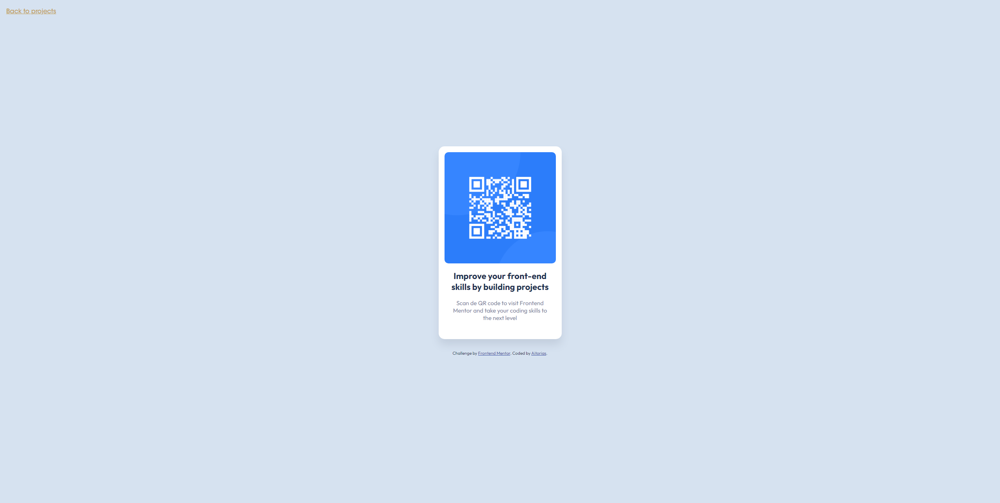
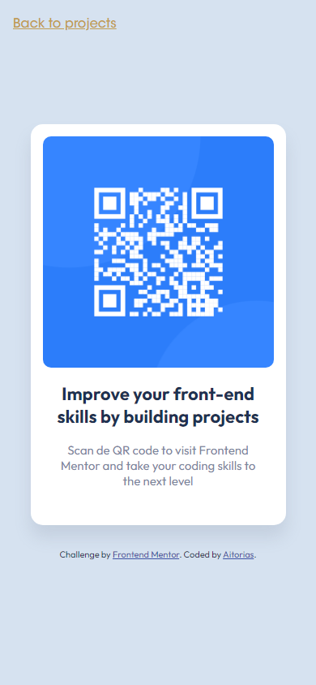

# Frontend Mentor - QR code component solution

This is a solution to the [QR code component challenge on Frontend Mentor](https://www.frontendmentor.io/challenges/qr-code-component-iux_sIO_H). Frontend Mentor challenges help you improve your coding skills by building realistic projects. 

## Table of contents

- [Frontend Mentor - QR code component solution](#frontend-mentor---qr-code-component-solution)
  - [Table of contents](#table-of-contents)
  - [Overview](#overview)
    - [Screenshot](#screenshot)
    - [Links](#links)
  - [My process](#my-process)
    - [Built with](#built-with)
    - [What I learned](#what-i-learned)
    - [Continued development](#continued-development)
  - [Author](#author)

## Overview

### Screenshot





### Links

- Solution URL: [https://github.com/aitorias/qr-code-component](https://github.com/aitorias/qr-code-component)
- Live Site URL: [https://aitorias.github.io/#/frontendmentor/qr-code](https://aitorias.github.io/#/frontendmentor/qr-code)

## My process

### Built with

- Semantic HTML5 markup
- CSS custom properties
- Flexbox
- Mobile-first workflow
- [React](https://react.dev/) - JS library

### What I learned

I have learned to better manage media-queries properties to increase the quality of my applications and projects.

```css
@media screen and (max-width: 914px) and (orientation: landscape) {
  .page {
    height: auto;
    padding-bottom: 28px;
    padding-top: 28px;
  }
}
```

### Continued development

I want to continue improving my development in React and libraries such as Tailwind CSS.

## Author

- Website - [Aitorias](https://aitorias.github.io)
- Frontend Mentor - [@aitorias](https://www.frontendmentor.io/profile/aitorias)
- LinkedIn - [/in/aitordediego](https://www.linkedin.com/in/aitordediego)
